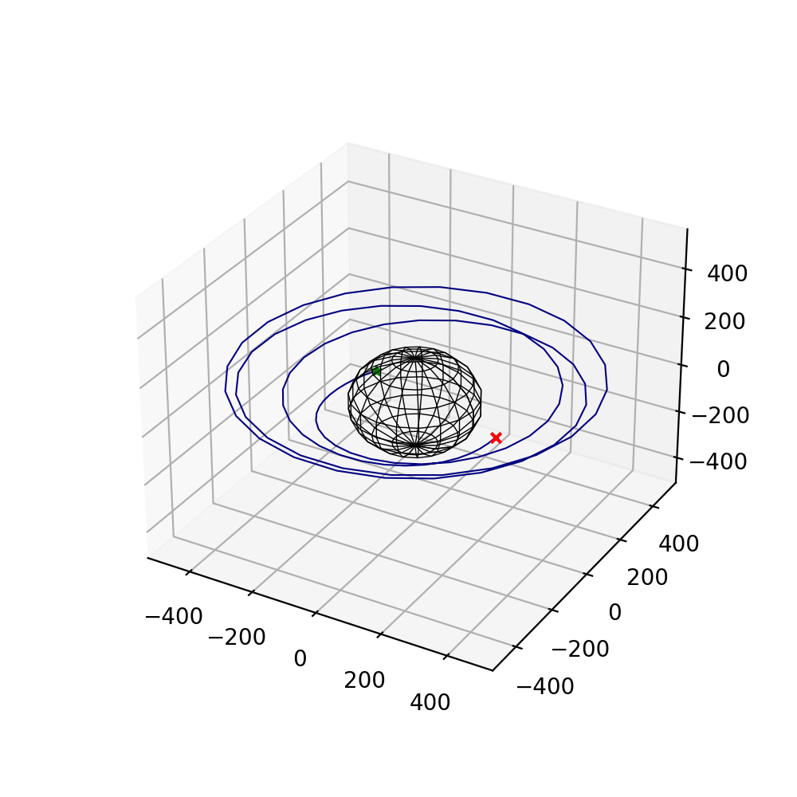

# trajplotlib
matplotlib extension functions to plot trajectories

[Read the docs!](https://trajplotlib.readthedocs.io/en/latest/)


### 3D trajectory with equal size axes

To generate a quick 3D trajectory plot with equal-axis is a one-liner: 

```python
import matplotlib.pyplot as plt
import trajplotlib

# compute/load data for xs, ys, zs

# create plot
ax = trajplotlib.quickplot3(xs, ys, zs, radius=184.0)
plt.show()
```

In the above, `xs`, `ys`, and `zs` are arrays of the trajectory coordinates, and `radius` is an optional value for plotting a sphere of radius `radius`. 

This generates the following: 

<p align="center">
  
</p>

The above function returns `ax`, which is an `Axes3DSubplot` object. As such, the plot may be modified or more elements may be appended just as one would do with regular `matplotlib`: 

```python
ax.set_xlabel('x, km')
ax.set_ylabel('y, km')
ax.set_zlabel('z, km')
ax.set_title("My trajectory")
```
