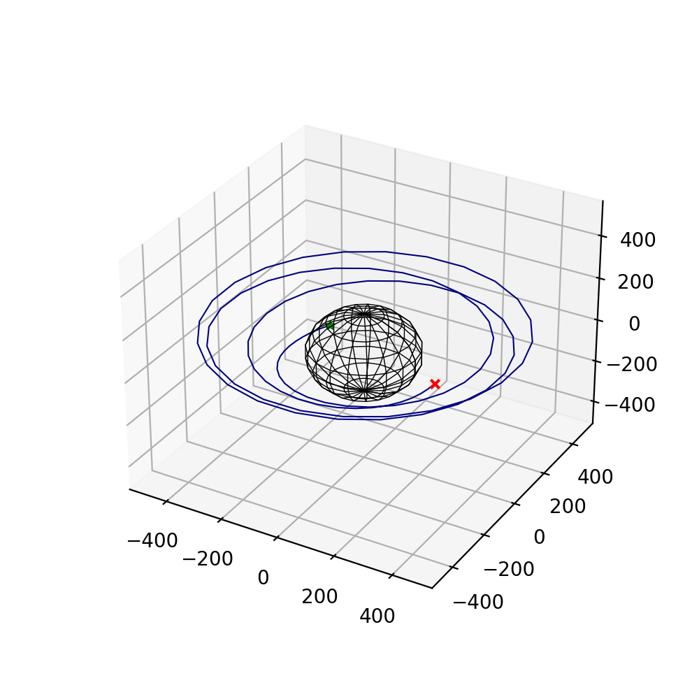

.. trajplotlib documentation master file, created by
   sphinx-quickstart on Tue Jul 20 18:46:44 2021.
   You can adapt this file completely to your liking, but it should at least
   contain the root `toctree` directive.

Welcome to trajplotlib's documentation!
=======================================

``trajplotlib`` is a collection of helper functions that support your day-to-day trajectory plotting needs by wrapping ``matplotlib``. 

.. toctree::
   :maxdepth: 2
   :caption: Contents:

   tutorials
   api

Indices and tables
==================

* :ref:`genindex`
* :ref:`modindex`
* :ref:`search`
